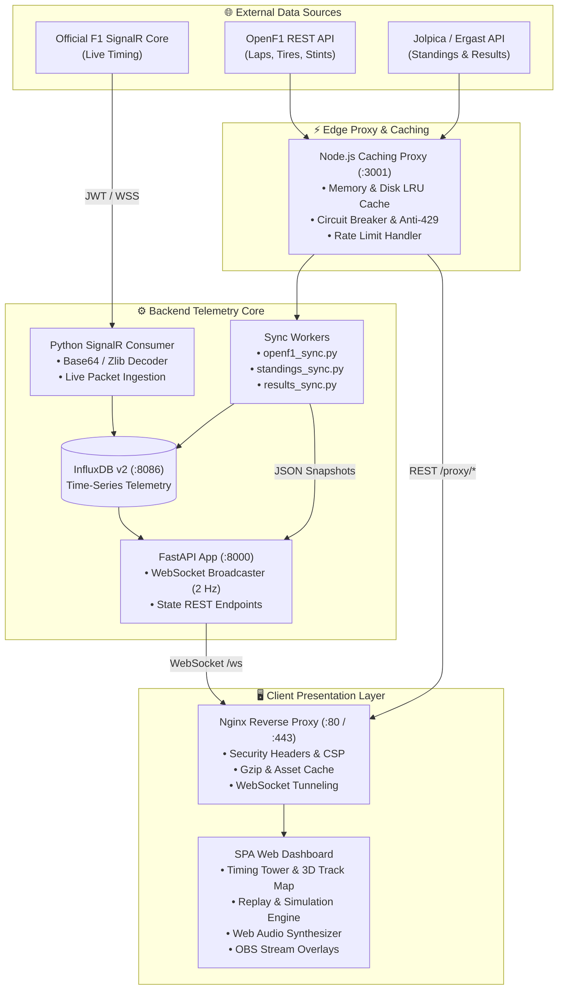

# 🏎️ F1 Telemetry & Analytics Hub (Season 2026)

[](https://opensource.org/licenses/MIT)
[](https://www.python.org/)
[](https://fastapi.tiangolo.com/)
[](https://nodejs.org/)
[](https://www.influxdata.com/)
[](https://www.docker.com/)
[]()
[](docs/PRESENTATION_FR.md)
[](CONTRIBUTING.md)

> **All-in-one Formula 1 Real-Time Telemetry, Live Timing Tower, 2D/3D Track Map, Race Simulation Engine, Audio Synthesizer, and Broadcast Overlays for Season 2026.**

📖 *Pour la documentation détaillée et le dossier technique en français, voir [docs/PRESENTATION_FR.md](docs/PRESENTATION_FR.md).*

---

## 🌟 Highlights & Key Features

- **⚡ Multi-Source Telemetry Pipeline**: Real-time SignalR live feed support, OpenF1 API integration, Ergast/Jolpica championship data sync, and high-frequency time-series persistence via **InfluxDB v2**.
- **🛡️ Anti-Rate-Limit Cache Proxy**: Dedicated high-performance Node.js proxy with in-memory LRU, disk-backed caching, exponential backoff, and circuit breakers preventing HTTP `429 Too Many Requests`.
- **🏁 Live Timing Tower**: Real-time driver intervals, leader gaps, sector deltas, speed trap telemetry, tire compound & age tracking, DRS activation, and pit status indicators.
- **🗺️ Interactive 2D & 3D Track Layout**: Dynamic GPS car position interpolation, corner numbering, sector markers, speed heatmap, and live driver tracking.
- **🎮 Simulation & Replay Engine**: Comprehensive race simulation mode with realistic tire degradation models, pit strategy windows, overtake predictions, and custom scenario playback.
- **🔊 Web Audio Synthesizer**: Built-in procedural audio engine generating dynamic V6 Turbo-Hybrid engine sound profiles, team radio alerts, pit-in cues, and race control flags.
- **📺 Broadcast & Streamer Overlays**: OBS Studio and Streamlabs-ready transparent widgets (lower-thirds, battle telemetry, mini-towers, and driver head-to-head comparisons).
- **🏆 2026 Regulations Ready**: Updated grid, liveries, team colors, sprint formats, and aerodynamics/engine regulations for the 2026 championship.
- **📱 Responsive Glassmorphic UI**: Ultra-sleek dark mode interface built with vanilla JavaScript and optimized CSS for desktop, tablets, mobile devices, and multi-monitor setups.
- **🚀 1-Click Plug & Play**: Zero-config universal setup script (`setup.py`, `setup.sh`, `setup.ps1`) generating secure secrets and launching the entire stack in seconds.

---

## 🏗️ Architecture Overview



---

## 🚀 Quick Start (Plug & Play)

Get the complete F1 Telemetry stack up and running in **under 1 minute**:

### Prerequisites
- [Docker Engine](https://docs.docker.com/engine/install/) & [Docker Compose v2+](https://docs.docker.com/compose/)
- Python 3.10+ (recommended for interactive setup, standard library only)

### 1. Clone the repository
```bash
git clone https://github.com/Klemz-696/f1-telemetry.git
cd f1-telemetry
```

### 2. Run the Universal Setup Assistant
The setup manager automatically checks system prerequisites, generates cryptographically strong passwords/tokens, configures `.env`, and starts all containers:

**Linux / macOS:**
```bash
chmod +x setup.sh && ./setup.sh
# or: python3 setup.py --quick
```

**Windows (PowerShell):**
```powershell
.\setup.ps1
# or: python setup.py --quick
```

### 3. Open the Dashboard
Navigate to **`http://localhost`** in your browser!

---

## 🕹️ Modes of Operation

The dashboard includes a versatile mode selector located in the top navigation bar:

| Mode | Indicator | Description | Source |
| :--- | :---: | :--- | :--- |
| **Auto** | 🔄 | Automatically detects live sessions and switches to real-time telemetry when a Grand Prix is live. | Dynamic Hybrid |
| **Direct Live** | 📡 | Real-time live timing directly connected to the official F1 SignalR feed. | F1 Live Timing |
| **Simulation** | 🎮 | Full race playback with realistic car telemetry, tire degradation curves, safety car phases, and overtake engine. | Local Physics Sim |
| **Archive** | 📼 | Instant replay and analytics of the most recently recorded Grand Prix session. | Cached Telemetry |
| **Offline** | ✈️ | Standings, season calendar, circuit maps, and driver profiles available without active data ingestion. | Static 2026 DB |

---

## 📺 Streaming Overlays (OBS Studio / Streamlabs)

F1 Telemetry includes broadcast-quality overlays optimized for live streamers and content creators:

- **Lower Third Banner**: Minimalist position ticker with tire compounds and live deltas.
- **Battle Telemetry**: Side-by-side telemetry comparison (throttle, brake, RPM, DRS, speed) between two fighting cars.
- **Timing Tower Widget**: Compact, transparent timing tower for the screen corner.

To integrate with OBS Studio:
1. In OBS, add a **Browser Source**.
2. Set URL to `http://localhost/#overlay` (or specific overlay hash).
3. Set Width: `1920`, Height: `1080`, and check **"Shutdown source when not visible"**.
4. See [`docs/STREAMING_OVERLAYS.md`](docs/STREAMING_OVERLAYS.md) for full instructions.

---

## ⚙️ Configuration & Environment Variables

All settings are configured via the `.env` file (generated automatically by `setup.py` from [`.env.example`](.env.example)):

| Variable | Default Value | Description |
| :--- | :--- | :--- |
| `INFLUX_USER` | `f1admin` | Administrative username for InfluxDB v2 |
| `INFLUX_PASSWORD` | *(Auto-generated)* | Cryptographically secure InfluxDB password |
| `INFLUX_TOKEN` | *(Auto-generated)* | Admin authorization token for InfluxDB read/writes |
| `F1_AUTH_TOKEN` | *(Empty / Optional)* | Official F1 TV Bearer token for direct live SignalR stream |
| `PROXY_PORT` | `3001` | Internal listening port for the Node.js cache proxy |
| `NODE_ENV` | `production` | Node.js execution environment |
| `ALLOWED_ORIGINS` | `http://localhost` | Comma-separated CORS whitelist for proxy endpoints |
| `FLUSH_TOKEN` | *(Auto-generated)* | Secret token required to purge the proxy cache via `/flush` |
| `API_ALLOWED_ORIGINS`| `http://localhost` | Comma-separated CORS whitelist for FastAPI |
| `HTTP_PORT` | `80` | External HTTP port exposed by Nginx on the host machine |
| `HTTPS_PORT` | `443` | External HTTPS port exposed by Nginx (with Certbot) |

---

## 🛠️ CLI Management (`setup.py`)

The included `setup.py` utility provides complete lifecycle management:

```bash
python setup.py                # Interactive main menu
python setup.py --check        # Run pre-flight diagnostics (Docker, ports, network)
python setup.py --env-only     # Generate .env with secure random tokens
python setup.py --start        # Build and start all Docker services
python setup.py --stop         # Stop all containers
python setup.py --status       # View container status and health
python setup.py --logs         # Follow real-time service logs
python setup.py --clean        # Purge temporary proxy cache files
```

---

## 🔒 Security & Privacy

- **No hardcoded secrets or personal tokens**: All credentials and tokens are environment-driven.
- **CORS & WebSocket Protection**: Origin validation on both FastAPI and Node.js proxy layers.
- **Isolated Docker Network**: InfluxDB runs on an internal, unexposed bridge network accessible only by backend microservices.
- **Nginx Hardening**: Built-in Content Security Policy (CSP), X-Frame-Options, X-Content-Type-Options, Referrer-Policy, and aggressive rate limiting per IP.

---

## 📚 Documentation Index

- [🇫🇷 Dossier Technique Complet (Français)](docs/PRESENTATION_FR.md)
- [🏛️ Architecture & Data Pipelines](docs/ARCHITECTURE.md)
- [📡 API & WebSocket Reference](docs/API.md)
- [📺 OBS & Streaming Overlays Setup](docs/STREAMING_OVERLAYS.md)
- [🔑 F1 TV Token Capture Tutorial](docs/F1_LIVE_TOKEN_GUIDE.md)
- [💻 Local Development Guide](docs/DEVELOPMENT.md)
- [🚀 GitHub Setup Guide](docs/GITHUB_SETUP_GUIDE.md)
- [🤝 Contributing Guidelines](CONTRIBUTING.md)
- [🛡️ Security Policy](SECURITY.md)

---

## 🧪 Running Tests

The test suite validates data schemas, SignalR decoder decompression, static 2026 data integrity, and API models:

```bash
# Run tests using pytest
pytest tests/ -v

# Or using Python's built-in unittest
python -m unittest discover -s tests -p "test_*.py" -v
```

---

## 📄 License

This project is open-source software licensed under the **[MIT License](LICENSE)**.

---

<p align="center">
  <b>Built with ❤️ for Formula 1 fans, developers, and telemetry enthusiasts around the world 🏎️💨</b>
</p>
