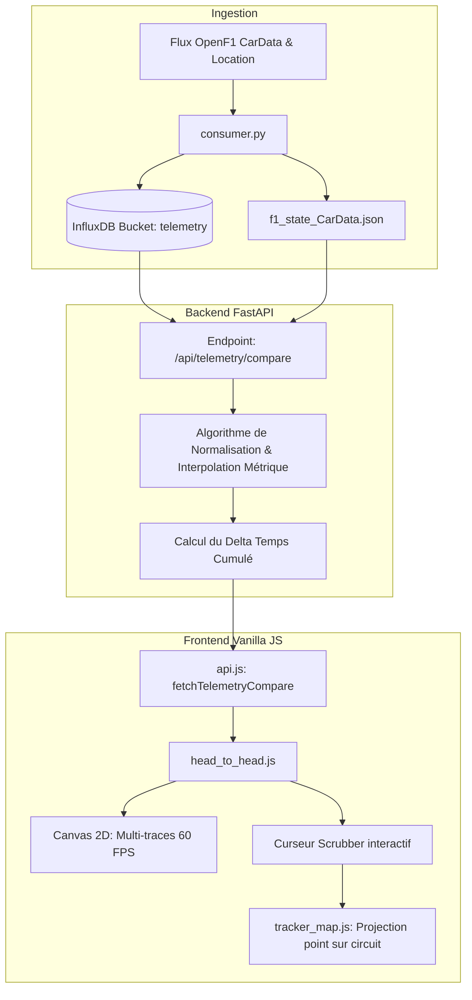

# Plan Technique : Télémétrie Comparative "Head-to-Head"

## 1. Contexte & Analyse du Besoin

### 1.1 Problématique
En Formule 1, la télémétrie brute en fonction du temps est difficilement comparable entre deux pilotes lorsque l'un possède une avance ou un retard. Deux voitures abordant le même virage à des instants distincts ne peuvent être superposées temporellement sans créer un décalage artificiel qui s'amplifie tout au long du tour.

### 1.2 Objectif
Créer un outil de comparaison télémétrique **Head-to-Head** permettant à l'utilisateur de sélectionner deux pilotes (ex: Verstappen vs Leclerc, ou deux coéquipiers) et d'afficher en haute fréquence leurs données superposées, synchronisées **sur la distance métrique du tour (en mètres)**.

---

## 2. Architecture Globale & Flux de Données



---

## 3. Spécifications Backend (Python & FastAPI)

### 3.1 Modèle de Données Pydantic (`backend/models.py`)
```python
from pydantic import BaseModel
from typing import List, Optional

class TelemetryTrace(BaseModel):
    driver_number: int
    acronym: str
    team_color: str
    lap_number: int
    speed: List[float]       # Vitesse en km/h
    throttle: List[float]    # % d'accélérateur (0-100)
    brake: List[float]       # % ou binaire de frein (0 ou 100)
    gear: List[int]          # Rapport engagé (1-8)
    drs: List[int]           # Statut DRS (0 = fermé, 1 = ouvert)

class TelemetryCompareResponse(BaseModel):
    session_key: int
    circuit_name: str
    circuit_length_m: float
    distance: List[float]    # Échantillonnage métrique régulier (ex: tous les 5m)
    driver_a: TelemetryTrace
    driver_b: TelemetryTrace
    delta_time: List[float]  # Delta en secondes (négatif = A plus rapide, positif = B plus rapide)
```

### 3.2 Algorithme de Normalisation Métrique (`backend/telemetry_compare.py`)
1. **Discrétisation de la piste** : Soit $L$ la longueur du tour en mètres. On crée un vecteur de distance uniforme :
   $$D = [0, \Delta d, 2\Delta d, \dots, L] \quad \text{avec } \Delta d = 5.0\text{ m}$$
2. **Interpolation Linéaire** : Pour chaque mesure discrète $d_i \in D$, les grandeurs $V(d_i), T(d_i), B(d_i)$ sont interpolées linéairement à partir des coordonnées GPS/odométrie brutes.
3. **Calcul du Delta de Temps Réel** :
   $$\Delta t(d_k) = \sum_{j=1}^{k} \left( \frac{\Delta d}{v_A(d_j) / 3.6} - \frac{\Delta d}{v_B(d_j) / 3.6} \right)$$
   Ce calcul permet d'observer précisément dans quel virage le temps est gagné ou perdu.

### 3.3 Endpoints FastAPI (`backend/main.py`)
- `GET /api/telemetry/compare` :
  - **Paramètres** :
    - `session_key` (int) : Identifiant de session.
    - `driver_a` (int) : Numéro du premier pilote.
    - `driver_b` (int) : Numéro du second pilote.
    - `mode` (str, défaut: `"live"`) : `"live"` (tour en cours) ou `"best"` (meilleurs tours personnels).
  - **Mise en cache** : Cache mémoire de 2 secondes pour les tours en cours, cache illimité pour les tours archivés.

---

## 4. Spécifications Frontend (Vanilla JS & Canvas 2D)

### 4.1 Structure HTML du Panneau Overlay (`frontend/index.html`)
Ajout d'un nouvel overlay draggable et redimensionnable dans le tableau de bord :
```html
<div class="dashboard-overlay" id="ov-compare" hidden>
  <div class="ov-drag-handle">
    <span class="ov-handle-label">⚡ TÉLÉMÉTRIE COMPARATIVE</span>
    <div class="compare-selectors">
      <select id="compare-drv-a" class="select-sm"></select>
      <span class="compare-vs">VS</span>
      <select id="compare-drv-b" class="select-sm"></select>
      <select id="compare-lap-mode" class="select-sm">
        <option value="live">Tour en cours</option>
        <option value="best">Meilleur tour</option>
      </select>
    </div>
    <button class="ov-btn-front" title="Premier plan">▲</button>
    <button class="ov-btn-back" title="Arrière plan">▼</button>
  </div>
  <div class="ov-content" id="compare-content">
    <div class="compare-summary-bar">
      <div id="compare-delta-display" class="compare-delta-badge">Δ --:--</div>
      <div id="compare-point-info" class="compare-point-info">Distance: -- m | Vitesses: -- / --</div>
    </div>
    <div class="canvas-container">
      <canvas id="canvas-telemetry"></canvas>
    </div>
  </div>
  <div class="ov-resize-handle">⤡</div>
</div>
```

### 4.2 Moteur de Tracé Haute Performance (`frontend/js/components/head_to_head.js`)
- Tracé direct via le contexte 2D d'un élément `<canvas>` avec support des écrans Retina (`window.devicePixelRatio`).
- **3 Pistes graphiques coordonnées verticalement** :
  1. **Trace 1 (Vitesse - 50% hauteur)** : Courbes de vitesse de 0 à 360 km/h. Remplissage dégradé subtil sous la courbe du pilote menant.
  2. **Trace 2 (Delta Temps - 25% hauteur)** : Ligne zéro centrale. Remplissage vert/rouge selon le pilote le plus rapide.
  3. **Trace 3 (Pédales & Boîte - 25% hauteur)** : Accélérateur (lignes pleines), frein (zones hachurées) et indicateurs numériques de rapport engagé.
- **Curseur Scrubber Interactif** :
  - Survol à la souris ou au touch : tracé d'une ligne verticale blanche translucide.
  - Déclenchement d'un événement `window.dispatchEvent(new CustomEvent('telemetry-scrub', { detail: { distance, ratio } }))`.
  - Dans `tracker_map.js` : mise à jour instantanée d'un repère visuel lumineux sur le circuit pour voir l'emplacement exact du virage analysé.

---

## 5. Gestion des Cas Particuliers & Erreurs

1. **Données télémétriques manquantes ou incomplètes** : Interpolation basée sur le tour précédent ou affichage d'une notification discrète d'attente d'échantillonnage.
2. **Voiture dans la voie des stands** : Détection du statut `in_pit` et arrêt de l'enregistrement de télémétrie comparative sur ce tour.
3. **Période de Safety Car / Drapeau Rouge** : Alerte visuelle *"Télémétrie sous neutralisation (non représentative)"*.

---

## 6. Plan de Déploiement en 3 Phases

- **Phase 1 : Backend & Normalisation** :
  - Création du module `backend/telemetry_compare.py`.
  - Intégration de l'interpolation métrique et des requêtes InfluxDB.
  - Tests unitaires de la fonction de calcul de delta de temps.
- **Phase 2 : Composant Visuel Frontend** :
  - Création de `frontend/js/components/head_to_head.js`.
  - Tracé Canvas optimisé à 60 FPS avec sélecteurs dynamiques de pilotes.
  - Ajout de l'overlay dans `overlay_manager.js`.
- **Phase 3 : Synchronisation Interactive & Tests** :
  - Liaison bidirectionnelle avec la carte du circuit `tracker_map.js`.
  - Validation sur sessions réelles et mode simulation.
