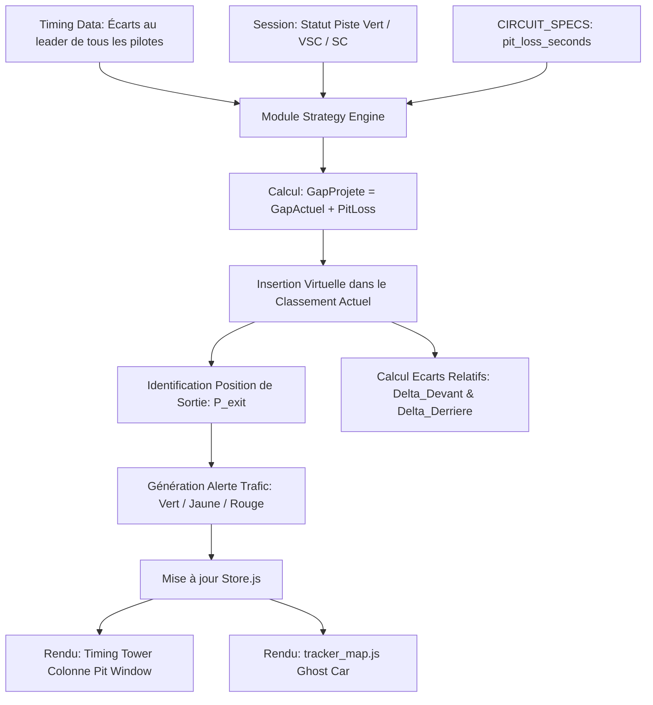

# Plan Technique : Simulateur de Fenêtre d'Arrêt aux Stands ("Pit Window")

## 1. Contexte & Analyse du Besoin

### 1.1 Problématique
En course de Formule 1, décider du moment optimal pour s'arrêter aux stands (*Pit Stop*) est l'un des choix stratégiques les plus décisifs. Un pilote peut perdre tout le bénéfice de sa vitesse s'il ressort dans le trafic derrière des monoplaces plus lentes ou dans un "train DRS". 
Actuellement, le dashboard affiche uniquement les écarts instantanés entre les voitures, obligeant l'utilisateur à estimer de tête où ressortirait un pilote après les 20 à 25 secondes perdues dans la voie des stands.

### 1.2 Objectif
Développer un simulateur prédictif en temps réel qui calcule et projette instantanément :
1. Le **rang virtuel de réinsertion sur la piste** (ex: *"P2 $\rightarrow$ ressortirait P7"*).
2. L'**écart net** avec la voiture qui se trouverait devant et derrière à la sortie des stands.
3. Un **indicateur de risque de trafic** (Piste dégagée / Trafic dense / Train DRS).
4. Une **projection visuelle sur la carte du circuit** sous la forme d'un repère fantôme (*Ghost Car*).

---

## 2. Modèle Mathématique de Perte au Stand

### 2.1 Formulation Physique
La perte de temps nette d'un passage par les stands ($T_{\text{pit loss}}$) ne correspond pas au temps passé dans la voie des stands, mais à la différence entre le temps pris par la voie des stands et le temps qu'aurait mis la monoplace en restant sur la piste à pleine vitesse :

$$T_{\text{pit loss}} = \frac{D_{\text{pit}}}{V_{\text{pit limit}}} + T_{\text{stationary}} - \frac{D_{\text{track parallel}}}{V_{\text{track average}}}$$

Où :
- $D_{\text{pit}}$ : Longueur de la pitlane (généralement 350 m à 450 m).
- $V_{\text{pit limit}}$ : Limite de vitesse dans la pitlane (80 km/h soit 22,2 m/s, ou 60 km/h soit 16,7 m/s à Monaco/Singapour/Zandvoort).
- $T_{\text{stationary}}$ : Temps d'immobilisation moyen pour le changement des 4 roues (fixé par défaut à 2,4 s).
- $D_{\text{track parallel}}$ / $V_{\text{track average}}$ : Temps de parcours sur la ligne droite des stands à vitesse de course (~280 km/h).

### 2.2 Table de Référence par Circuit (`backend/data/f1_2026.py`)
Chaque circuit de la saison 2026 est calibré avec ses valeurs mesurées :

| Circuit | Limite Pitlane | Perte Standard ($T_{\text{pit loss}}$) | Perte sous VSC ($\approx -35\%$) | Perte sous Safety Car ($\approx -55\%$) |
| :--- | :---: | :---: | :---: | :---: |
| **Red Bull Ring** | 80 km/h | **20.2 s** | **13.1 s** | **9.1 s** |
| **Monza** | 80 km/h | **24.1 s** | **15.6 s** | **10.8 s** |
| **Silverstone** | 80 km/h | **24.8 s** | **16.1 s** | **11.2 s** |
| **Monaco** | 60 km/h | **22.4 s** | **14.5 s** | **10.1 s** |
| **Singapour** | 60 km/h | **28.9 s** | **18.8 s** | **13.0 s** |
| **Spa-Francorchamps** | 80 km/h | **22.8 s** | **14.8 s** | **10.3 s** |

*Note stratégique* : Le modèle prend automatiquement en compte le statut de la piste (`track_status` : 4 = Safety Car, 6 = Virtual Safety Car) pour diviser la perte au stand par le facteur approprié ("*Pit stop gratuit*" ou *cheap pit stop*).

---

## 3. Architecture & Algorithme de Calcul



### 3.1 Algorithme de Réinsertion Virtuelle (`frontend/js/components/pit_strategy.js`)
```javascript
export function computePitExitPosition(driver, allStandings, circuitSpec, trackStatus) {
  // Ajustement de la perte selon neutralisation
  let loss = circuitSpec.pit_loss_seconds || 23.0;
  if (trackStatus === "4") loss *= 0.45;       // Safety Car
  else if (trackStatus === "6") loss *= 0.65;  // VSC

  const currentGap = parseGapToLeader(driver.gap_to_leader);
  if (currentGap === null) return null;

  const projectedGap = currentGap + loss;

  // Recherche de la position d'insertion dans le peloton
  let projectedPos = 1;
  let carAhead = null;
  let carBehind = null;

  const validDrivers = allStandings.filter(d => !d.retired && d.driver_number !== driver.driver_number);

  for (let i = 0; i < validDrivers.length; i++) {
    const other = validDrivers[i];
    const otherGap = parseGapToLeader(other.gap_to_leader) || 0;

    if (projectedGap > otherGap) {
      projectedPos = other.position + 1;
      carAhead = other;
    } else {
      if (!carBehind) carBehind = other;
    }
  }

  // Calcul du risque de trafic
  const gapAhead = carAhead ? Math.abs(projectedGap - (parseGapToLeader(carAhead.gap_to_leader) || 0)) : 999;
  const gapBehind = carBehind ? Math.abs((parseGapToLeader(carBehind.gap_to_leader) || 0) - projectedGap) : 999;

  let trafficRisk = "CLEAR"; // Vert
  if (gapAhead < 1.2) trafficRisk = "TRAFFIC_DRS"; // Rouge (bloqué dans le DRS)
  else if (gapAhead < 2.5) trafficRisk = "CLOSE";   // Jaune (proche)

  return {
    projectedPosition: projectedPos,
    lossApplied: loss,
    carAhead: carAhead ? { acronym: carAhead.acronym, gap: gapAhead } : null,
    carBehind: carBehind ? { acronym: carBehind.acronym, gap: gapBehind } : null,
    trafficRisk
  };
}
```

---

## 4. Intégration Visuelle dans l'Interface

### 4.1 Timing Tower : Mode "Stratégie Stands"
Dans `frontend/js/components/timing_tower.js` :
- Ajout d'un bouton d'action rapide dans le bandeau supérieur : **`⏱️ STRATÉGIE`**.
- Lorsque ce mode est actif :
  - La colonne des temps au tour est remplacée par la colonne **`SORTIE STAND`**.
  - Affiche le rang projeté avec pastille de couleur :
    - Vert vif (`#00e676`) si piste dégagée ($> 3.0\text{ s}$).
    - Orange (`#ffb300`) si réinsertion à moins de $2.0\text{ s}$ d'une voiture.
    - Rouge vif (`#ff1744`) si coincé à moins de $1.0\text{ s}$ d'une monoplace plus lente.
  - Au survol d'une ligne : infobulle stratégique détaillée (*"Ressortirait P5 derrière ALO (+0.6s) et devant GAS (-1.8s)"*).

### 4.2 Carte du Circuit (`frontend/js/components/tracker_map.js`) : Monoplace Fantôme
- Lors de la sélection d'un pilote dans la tour :
  - Calcul de la coordonnée GPS correspondante sur le tracé pour sa position après perte au stand.
  - Rendu d'une **Ghost Car** représentée par un point translucide avec contour pointillé et halo lumineux aux couleurs de l'écurie.
  - Permet de visualiser en un coup d'œil où se situe le peloton de trafic par rapport au pilote.

---

## 5. Plan de Déploiement en 3 Phases

- **Phase 1 : Données et Moteur de Calcul** :
  - Renseignement des valeurs `pit_loss_seconds` dans `backend/data/f1_2026.py` pour les 24 circuits.
  - Implémentation du module de calcul `frontend/js/components/pit_strategy.js`.
  - Tests unitaires sur des cas types (Course normale, sous SC, peloton compact).
- **Phase 2 : Intégration Timing Tower** :
  - Ajout du bouton de bascule et affichage des positions projetées.
  - Stylisation CSS des pastilles de trafic et des tooltips d'undercut.
- **Phase 3 : Affichage Carte du Circuit** :
  - Intégration de la voiture fantôme sur le canvas du circuit dans `tracker_map.js`.
  - Validation interactive avec les différents circuits de la saison.
