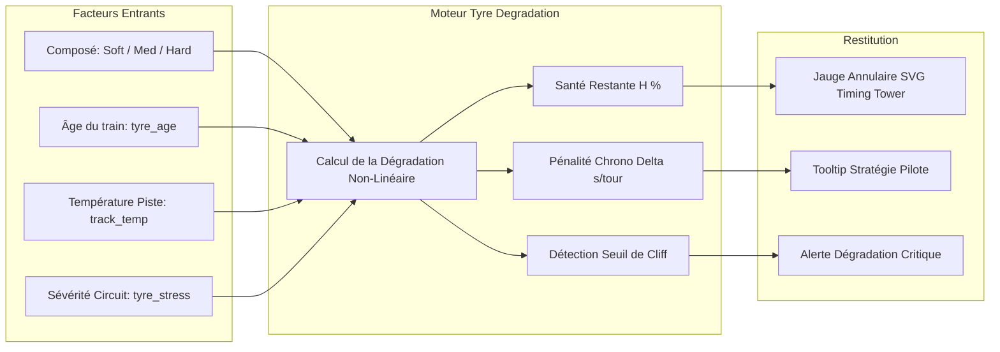

# Plan Technique : Modélisation Prédictive de l'Usure des Gommes (Pirelli Tyre Model)

## 1. Contexte & Analyse du Besoin

### 1.1 Problématique
En F1, la FIA et Pirelli ne transmettent jamais publiquement la télémétrie interne des capteurs de température ou d'usure des pneumatiques (données confidentielles des écuries). Les flux publics (OpenF1) ne fournissent que l'âge du train en tours (`tyre_age`) et le composé utilisé (`compound`).
Cependant, pour les stratèges et les spectateurs, savoir si un pneu est encore dans sa fenêtre d'adhérence optimale ou s'il approche de la falaise de dégradation ("*tyre cliff*") est fondamental pour anticiper les dépassements et les changements de rythme.

### 1.2 Objectif
Développer un modèle mathématique prédictif déterministe qui estime pour chaque pilote :
1. Le **pourcentage d'usure estimée** (de 100% neuf à 0% critique).
2. La **perte de performance au tour** en secondes ($\Delta \text{Pace}$ en s/tour).
3. L'approche imminente de la zone de **rupture de performance (Cliff)**.
4. L'affichage d'une jauge visuelle intuitive (anneau de gomme) directement intégrée dans la Timing Tower et la fiche pilote.

---

## 2. Modèle Mathématique de Dégradation Pirelli



### 2.1 Formulation Mathématique
L'usure d'un pneumatique de Formule 1 suit une courbe en deux phases : une dégradation progressive linéaire au début du relais, suivie d'une accélération exponentielle causée par la dégradation thermique profonde (décollement des gommes) :

$$H(n) = \max\left(0, 100 \times \left(1 - \left(\frac{n}{L_{\text{opt}}}\right)^{\alpha}\right)\right)$$

Où :
- $n$ : Âge actuel du train en tours (`driver.tyre_age`).
- $L_{\text{opt}}$ : Longévité théorique maximale avant dégradation critique, calculée selon la formule :
  $$L_{\text{opt}} = \frac{L_{\text{base}}(\text{compound})}{\beta_{\text{circuit}} \cdot \gamma_{\text{temp}}}$$
- $\alpha = 1.35$ : Exposant de progressivité simulant la chute abrupte en fin de relais (*Cliff*).

### 2.2 Paramètres de Calibration 2026
1. **Longévité de base selon le composé ($L_{\text{base}}$)** :
   - **Tendre (Soft / Rouge)** : $L_{\text{base}} = 18\text{ tours}$ (performance maximale immédiate, forte dégradation).
   - **Médium (Jaune)** : $L_{\text{base}} = 28\text{ tours}$ (compromis idéal en course).
   - **Dur (Hard / Blanc)** : $L_{\text{base}} = 42\text{ tours}$ (endurance élevée, montée en température plus lente).
   - **Intermédiaire (Vert)** : $L_{\text{base}} = 30\text{ tours}$ (dépend fortement de l'humidité de la piste).
   - **Pluie (Wet / Bleu)** : $L_{\text{base}} = 35\text{ tours}$.

2. **Facteur de sévérité du circuit ($\beta_{\text{circuit}}$)** issu de `CIRCUIT_SPECS` :
   - Circuit à fort appui / asphalte abrasif (ex: Silverstone, Suzuka, Barcelone, Spa) : $\beta = 1.25$.
   - Circuit moyen (ex: Melbourne, Spielberg, Budapest, Monza) : $\beta = 1.00$.
   - Circuit urbain à faible abrasion (ex: Monaco, Bakou, Las Vegas) : $\beta = 0.85$.

3. **Facteur de température de piste ($\gamma_{\text{temp}}$)** issu de `weather.track_temp` :
   $$\gamma_{\text{temp}} = 1.0 + \max\left(0, \frac{T_{\text{piste}} - 35^{\circ}\text{C}}{100}\right)$$
   *(Exemple : à $50^{\circ}\text{C}$ de température de piste, l'usure thermique s'accélère de $+15\%$)*.

### 2.3 Calcul de la Perte au Tour ($\Delta \text{Pace}$)
$$\Delta \text{Pace}(n) = K_{\text{comp}} \cdot \left(\frac{n}{10}\right)^{1.2} \quad \text{[secondes/tour]}$$
- Soft : $K = 0.08\text{ s}$
- Medium : $K = 0.05\text{ s}$
- Hard : $K = 0.03\text{ s}$

---

## 3. Implémentation Logicielle

### 3.1 Module Frontend (`frontend/js/components/tyre_model.js`)
```javascript
export function evaluateTyreHealth(driver, circuitSpec, weather) {
  const age = parseInt(driver.tyre_age || 0, 10);
  const compound = (driver.compound || "MEDIUM").toUpperCase();

  const BASE_LAPS = {
    SOFT: 18,
    MEDIUM: 28,
    HARD: 42,
    INTERMEDIATE: 30,
    WET: 35
  };

  const baseLaps = BASE_LAPS[compound] || 28;

  // Facteur circuit
  const stress = circuitSpec?.characteristics?.tyre_stress || "Moyen";
  const betaCircuit = stress === "Élevé" || stress === "High" ? 1.25 : (stress === "Faible" || stress === "Low" ? 0.85 : 1.0);

  // Facteur température
  const trackTemp = weather?.track_temp || 35;
  const gammaTemp = 1.0 + Math.max(0, (trackTemp - 35) / 100);

  const effectiveLife = baseLaps / (betaCircuit * gammaTemp);
  const ratio = Math.min(1.0, age / effectiveLife);
  const healthPercent = Math.max(0, Math.round(100 * (1 - Math.pow(ratio, 1.35))));

  // Perte de rythme en secondes
  const kFactors = { SOFT: 0.08, MEDIUM: 0.05, HARD: 0.03, INTERMEDIATE: 0.06, WET: 0.06 };
  const k = kFactors[compound] || 0.05;
  const paceLossSec = +(k * Math.pow(age / 10, 1.2)).toFixed(2);

  // Statut
  let status = "OPTIMAL";
  let statusColor = "#00e676"; // Vert
  if (healthPercent < 20) {
    status = "CLIFF";
    statusColor = "#e53935"; // Rouge
  } else if (healthPercent < 45) {
    status = "WARNING";
    statusColor = "#ff9800"; // Orange
  } else if (healthPercent < 70) {
    status = "DEGRADED";
    statusColor = "#ffd700"; // Jaune
  }

  return {
    healthPercent,
    paceLossSec,
    status,
    statusColor,
    isCliffApproaching: healthPercent <= 25
  };
}
```

---

## 4. Intégration Visuelle (UI / UX)

### 4.1 Timing Tower : Jauge Annulaire SVG Haute Définition
Dans chaque ligne de la Timing Tower (`timing_tower.js`), la pastille de pneu actuelle est enrichie d'une mini-jauge annulaire circulaire :
```html
<div class="tyre-pill-gauge" title="Usure estimée: 68% · Perte rythme: +0.35s/tour">
  <svg class="tyre-svg-ring" viewBox="0 0 36 36">
    <path class="tyre-ring-bg" d="M18 2.0845 a 15.9155 15.9155 0 0 1 0 31.831 a 15.9155 15.9155 0 0 1 0 -31.831" />
    <path class="tyre-ring-val" stroke="#ffd700" stroke-dasharray="68, 100" d="M18 2.0845 a 15.9155 15.9155 0 0 1 0 31.831 a 15.9155 15.9155 0 0 1 0 -31.831" />
  </svg>
  <span class="tyre-letter">M</span>
  <span class="tyre-age-num">14T</span>
</div>
```

### 4.2 Fiche Détaillée Pilote (`standings.js`)
- Ajout d'une section **"Gestion des Pneumatiques"** :
  - Jauge semi-circulaire animée avec pourcentage de vie du pneu.
  - Alerte visuelle clignotante lorsque le pneu entre dans la zone critique ($< 20\%$).
  - Graphique d'évolution des temps au tour avec courbe de tendance de dégradation théorique superposée.

---

## 5. Plan de Déploiement en 3 Phases

- **Phase 1 : Calibration Mathématique & Tests** :
  - Création du module `frontend/js/components/tyre_model.js`.
  - Étalonnage des coefficients de dégradation sur des courses historiques 2024/2025/2026.
- **Phase 2 : Rendu Graphique SVG & CSS** :
  - Conception de la pastille annulaire SVG dans `timing_tower.js`.
  - Stylisation CSS avec transitions fluides à chaque mise à jour du compteur de tours.
- **Phase 3 : Intégration Fiches Pilotes & Alertes** :
  - Enrichissement de la modale pilote dans `standings.js`.
  - Déclenchement d'un avertissement sonore/visuel lorsque le pilote favori entre dans le *Cliff*.
