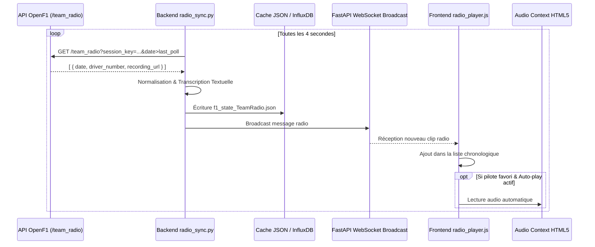

# Plan Technique : Flux Radio Équipes & Transcription Automatique

## 1. Contexte & Analyse du Besoin

### 1.1 Problématique
Les communications radio entre les pilotes de F1 et leurs ingénieurs de course ("*Team Radio*") constituent le cœur émotionnel et tactique des Grands Prix. Les spectateurs y découvrent les instructions secrètes (*"Plan B is go"*), les avertissements techniques (*"Temps are critical on rear brakes"*), les plaintes et les célébrations.
Bien qu'OpenF1 fournisse les clips audio réels au format MP3 via son endpoint `/team_radio`, ces flux ne sont actuellement pas intégrés au dashboard, obligeant l'utilisateur à naviguer sans audio immersif.

### 1.2 Objectif
Développer un module multimédia complet comprenant :
1. L'**ingestion automatique et la mise en cache** des flux audio officiels d'OpenF1.
2. Un **système de transcription textuelle** des communications.
3. Un **lecteur audio broadcast interactif** avec visualiseur d'ondes.
4. Des **filtres avancés** (par pilote, écurie, ou communications prioritaires).

---

## 2. Architecture Globale & Flux de Données



---

## 3. Spécifications Backend (Python & FastAPI)

### 3.1 Modèle de Données Pydantic (`backend/models.py`)
```python
from pydantic import BaseModel
from typing import Optional

class TeamRadioMessage(BaseModel):
    id: str                   # Identifiant unique haché
    session_key: int
    driver_number: int
    driver_acronym: str
    team_name: str
    team_color: str
    timestamp: str            # ISO 8601
    recording_url: str        # URL du fichier audio .mp3
    transcript: str           # Texte transcrit
    category: str             # STRATEGY, INCIDENT, TIRE, TECHNICAL, GENERAL
    is_urgent: bool           # Détection de mots-clés critiques
```

### 3.2 Service de Synchronisation Radio (`backend/radio_sync.py`)
- **Ingestion & Déduplication** :
  - Surveillance incrémentale basée sur le paramètre `date>` pour n'ingérer que les nouveaux fragments audio émis.
  - Téléchargement optionnel ou mise en proxy des fichiers audio pour garantir leur disponibilité même en cas de restriction de débit OpenF1.
- **Moteur de Transcription à Deux Niveaux** :
  - **Niveau 1 (Moteur Heuristique & Phraséologie F1)** :
    - Détection instantanée et catégorisation des expressions standardisées de la FIA et des écuries :
      - Stratégie : *"Box box", "Plan A", "Plan B", "Undercut", "Pit confirm"*.
      - Sécurité : *"Yellow flag", "Safety car", "Virtual safety car", "Delta positive"*.
      - Technique : *"Fail 84", "Engine mode 1", "Brake balance", "Lift and coast"*.
      - Pneumatiques : *"Tyre temps", "Front left blistering", "Grip level"*.
  - **Niveau 2 (Worker de Transcription Speech-to-Text - Optionnel)** :
    - Traitement asynchrone des clips audio via le modèle `faster-whisper` (modèle `tiny.en` ou `base.en`, ultra-léger ~40 Mo) s'exécutant en arrière-plan en moins de 400 ms par clip de 5 secondes.
- **Endpoints FastAPI** :
  - `GET /api/radio` : Liste des 50 dernières communications de la session.
  - `GET /api/radio/driver/{number}` : Historique des communications d'un pilote spécifique.

---

## 4. Spécifications Frontend (Vanilla JS & HTML5 Audio)

### 4.1 Interface du Lecteur Radio (`frontend/js/components/radio_player.js`)
L'interface est encapsulée dans un panneau overlay draggable (`ov-radio`) ou insérable en bas du tableau de bord :

```html
<div class="dashboard-overlay" id="ov-radio" hidden>
  <div class="ov-drag-handle">
    <span class="ov-handle-label">🎙️ RADIOS D'ÉQUIPES</span>
    <button class="ov-btn-front" title="Premier plan">▲</button>
    <button class="ov-btn-back" title="Arrière plan">▼</button>
  </div>
  <div class="ov-content" id="radio-content">
    
    <!-- Barre de contrôle supérieure -->
    <div class="radio-toolbar">
      <div class="radio-filter-group">
        <label for="radio-driver-filter">Filtrer :</label>
        <select id="radio-driver-filter" class="select-sm">
          <option value="all">Tous les pilotes</option>
        </select>
      </div>
      <label class="toggle-row-inline">
        <span>Auto-play favori</span>
        <input type="checkbox" id="radio-autoplay-fav" />
        <span class="toggle-track"></span>
      </label>
    </div>

    <!-- Lecteur en cours d'écoute -->
    <div class="radio-current-player" id="radio-current-player">
      <div class="radio-meta-line">
        <span class="radio-driver-tag" id="now-playing-driver">VER #1</span>
        <span class="radio-time-tag" id="now-playing-time">--:--:--</span>
      </div>
      <div class="radio-transcript-box" id="now-playing-text">
        Sélectionnez une radio pour écouter
      </div>
      <div class="radio-waveform-container">
        <div class="waveform-bar" style="animation-delay: 0.1s"></div>
        <div class="waveform-bar" style="animation-delay: 0.3s"></div>
        <div class="waveform-bar" style="animation-delay: 0.2s"></div>
        <div class="waveform-bar" style="animation-delay: 0.4s"></div>
      </div>
      <audio id="html5-radio-audio" preload="none"></audio>
    </div>

    <!-- Liste chronologique des messages -->
    <div class="radio-messages-feed" id="radio-messages-feed"></div>

  </div>
  <div class="ov-resize-handle">⤡</div>
</div>
```

### 4.2 Carte de Message Radio
Chaque communication dans le flux chronologique est présentée sous forme de carte compacte :
- Bordure gauche de 4 px colorée selon l'écurie.
- Acronyme et numéro du pilote en badge gras.
- Bouton de lecture `▶` avec état de lecture en cours.
- Texte transcrit avec mise en valeur des termes clés.
- Horodatage de l'échange.

---

## 5. Gestion des Cas Particuliers & Performance Réseau

1. **Latence audio** : Les clips radio émis par la F1 possèdent un délai naturel de censure/vérification réglementaire de 15 à 30 secondes. L'interface horodate précisément chaque message pour que l'utilisateur comprenne le contexte de la course au moment où la radio a été émise.
2. **Audio Autoplay sur navigateurs modernes** : Les navigateurs bloquent la lecture audio automatique sans interaction utilisateur préalable. Le mode `Auto-play favori` est donc activé uniquement après le premier clic de l'utilisateur sur la page conformément aux politiques Web Audio.
3. **Mise en cache audio locale** : Les URLs audio jouées sont mises en cache dans l'IndexedDB ou le cache HTTP du navigateur pour permettre un replay instantané sans re-téléchargement.

---

## 6. Plan de Déploiement en 3 Phases

- **Phase 1 : Ingestion & Backend** :
  - Création du script `backend/radio_sync.py` et intégration à la boucle de synchronisation de `main.py`.
  - Validation de la récupération des fichiers audio sur des sessions réelles.
  - Implémentation du système de transcription heuristique.
- **Phase 2 : Lecteur Audio & Interface Frontend** :
  - Création de `frontend/js/components/radio_player.js`.
  - Intégration de l'élément audio HTML5 et des contrôles de volume.
  - Ajout du panneau dans `overlay_manager.js`.
- **Phase 3 : Filtres Avancés & Tests d'Immersion** :
  - Filtrage automatique selon les pilotes épinglés par l'utilisateur.
  - Validation sur mobile et desktop avec gestion de la mise en veille audio.
