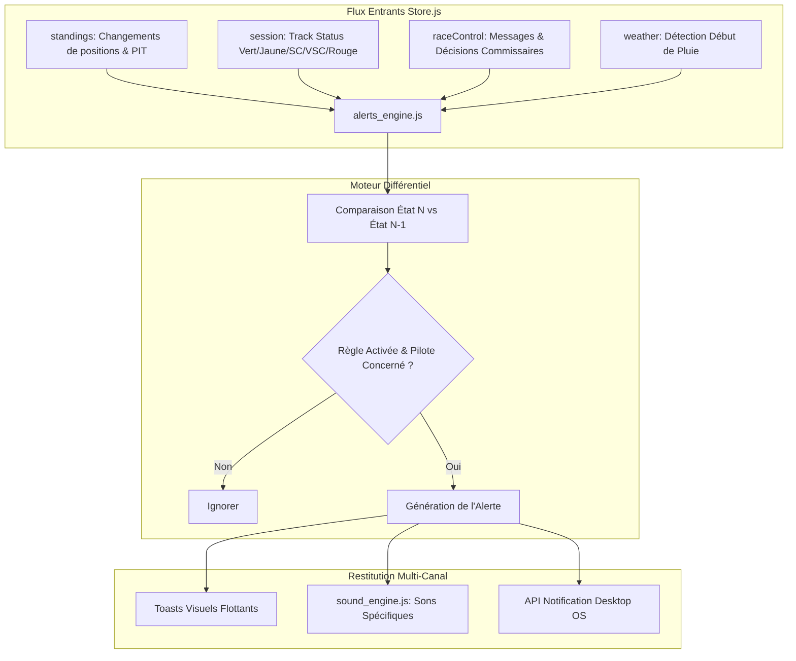

# Plan Technique : Système d'Alertes Personnalisables ("Race Strategist Alerts")

## 1. Contexte & Analyse du Besoin

### 1.1 Problématique
Une course de Formule 1 génère des dizaines de micro-événements chaque minute : arrêts aux stands, dépassements, enquêtes des commissaires, chutes de rythme, déploiement du Safety Car ou détection de pluie.
Lorsque l'utilisateur est concentré sur la carte ou regarde la retransmission télévisée en parallèle, il manque souvent l'instant précis où son pilote favori s'arrête ou subit une pénalité. Les alertes de direction de course actuelles sont mélangées dans un flux textuel brut sans hiérarchisation ni personnalisation.

### 1.2 Objectif
Créer un moteur d'alertes intelligent, hautement paramétrable par l'utilisateur, capable de délivrer des notifications :
1. **Visuelles** : Bannières "Toasts" élégantes et non intrusives dans un coin de l'écran.
2. **Sonores** : Signaux acoustiques différenciés selon la sévérité via `sound_engine.js`.
3. **Système (Desktop)** : Notifications natives du navigateur (OS) si l'onglet est en arrière-plan.
4. **Ciblées** : Possibilité de filtrer les alertes exclusivement pour les pilotes épinglés (*Pinned Drivers*).

---

## 2. Architecture du Moteur d'Alertes



---

## 3. Catalogue des Règles & Déclencheurs Détectés

| # | Type d'Alerte | Déclencheur Algorithmique | Son Associé | Niveau Priorité |
| :---: | :--- | :--- | :---: | :---: |
| **1** | **Arrêt au stand ciblé** | `driver.in_pit === true` (précédemment `false`) sur pilote suivi | *Pit Bell* (carillon doux) | 🟡 Moyenne |
| **2** | **Neutralisation Course** | `session.track_status` passe à `4` (SC), `6` (VSC) ou `5` (Red Flag) | *Siren Alert* (signal distinctif) | 🔴 Critique |
| **3** | **Meilleur Tour Absolu** | Nouveau `best_lap === true` ou temps violet détecté | *Laser Chime* (bip aigu dynamique) | 🟢 Info |
| **4** | **Changement de Leader** | `standings[0].driver_number` différent du tour précédent | *Lead Horn* | 🟡 Moyenne |
| **5** | **Dépassement Pilote Suivi** | `delta_position > 0` ou `delta_position < 0` sur pilote favori | *Whoosh Click* | 🟢 Info |
| **6** | **Enquête / Pénalité** | Message Direction de course contenant `"INVESTIGATION"` ou `"PENALTY"` | *Steward Gong* | 🟠 Haute |
| **7** | **Alerte Pluie** | `weather.rainfall === true` (précédemment `false`) | *Rain Drop Tone* | 🟠 Haute |

---

## 4. Spécifications Frontend (Vanilla JS & CSS)

### 4.1 Modèle de Configuration dans le `store.js`
Ajout de la structure de préférences utilisateur persistée dans `localStorage` :
```javascript
const defaultAlertsConfig = {
  enabled: true,
  desktopNotifications: false,
  soundAlerts: true,
  onlyFavoriteDrivers: true,
  triggers: {
    pitStops: true,
    safetyCar: true,
    fastestLap: true,
    leadChange: true,
    positionChanges: true,
    stewardsDecisions: true,
    rainArrival: true
  }
};
```

### 4.2 Moteur Différentiel (`frontend/js/components/alerts_engine.js`)
Pour éviter tout spam ou déclenchement intempestif au rechargement de la page, le moteur maintient un état de référence initialisé à froid :
```javascript
let _lastTrackStatus = "1";
let _lastLeaderNumber = null;
let _lastBestLapTime = null;
let _lastPitStates = new Map();
let _processedRcIds = new Set();
let _lastRainState = false;

export function evaluateAlerts(state) {
  if (!state.preferences?.alerts?.enabled) return;

  const conf = state.preferences.alerts;
  const pinned = state.pinnedDrivers || new Set();

  // 1. Détection Safety Car / VSC
  const currentStatus = String(state.session?.track_status || "1");
  if (conf.triggers.safetyCar && currentStatus !== _lastTrackStatus) {
    if (currentStatus === "4") spawnAlert("SAFETY CAR DÉPLOYÉ", "Safety Car en piste — Rythme neutralisé", "critical", "sc");
    else if (currentStatus === "6") spawnAlert("VIRTUAL SAFETY CAR", "VSC activé — Respectez le delta de temps", "warning", "vsc");
    else if (currentStatus === "5") spawnAlert("DRAPEAU ROUGE", "Séance suspendue — Retournez aux stands", "critical", "red_flag");
    _lastTrackStatus = currentStatus;
  }

  // 2. Détection Arrêts aux stands
  if (conf.triggers.pitStops && state.standings) {
    for (const d of state.standings) {
      const wasInPit = _lastPitStates.get(d.driver_number) || false;
      const isNowInPit = !!d.in_pit;
      if (!wasInPit && isNowInPit) {
        if (!conf.onlyFavoriteDrivers || pinned.has(d.driver_number)) {
          spawnAlert("ARRÊT AU STAND", `${d.acronym} (#${d.driver_number}) entre dans la voie des stands`, "info", "pit");
        }
      }
      _lastPitStates.set(d.driver_number, isNowInPit);
    }
  }

  // 3. Détection Météo Pluie
  const isRaining = !!state.weather?.rainfall;
  if (conf.triggers.rainArrival && isRaining && !_lastRainState) {
    spawnAlert("PLUIE DÉTECTÉE", "Précipitations signalées sur le circuit !", "warning", "rain");
  }
  _lastRainState = isRaining;
}
```

### 4.3 Système de Toasts Visuels (`frontend/index.html` & `frontend/css/style.css`)
Conteneur injecté dans le DOM :
```html
<div id="alerts-toast-container" class="alerts-toast-container" aria-live="polite"></div>
```

Comportement visuel du Toast :
- Positionné en haut à droite sous la barre de navigation.
- Bordure lumineuse avec animation de slide-in latérale.
- Barre de progression inférieure chronométrée de 5 secondes avant fermeture automatique.
- Bouton de fermeture manuelle `✕` et clic direct pour naviguer vers le panneau concerné.

---

## 5. Intégration dans la Modale des Paramètres (`settings.html` / `settings.js`)

Ajout d'une nouvelle section **"🔔 Notifications & Alertes Course"** dans la modale de réglages :
- Toggle principal : *"Activer le système d'alertes en direct"*.
- Toggle : *"Restreindre aux pilotes favoris épinglés"*.
- Toggle : *"Activer les alertes sonores"*.
- Bouton : *"Autoriser les notifications de bureau (OS)"* demandant la permission via `Notification.requestPermission()`.
- Liste de cases à cocher individuelles par déclencheur (Pit stops, Safety Car, Temps violet, Décisions FIA, Pluie).

---

## 6. Plan de Déploiement en 3 Phases

- **Phase 1 : Moteur Différentiel & Stockage** :
  - Création du composant `frontend/js/components/alerts_engine.js`.
  - Intégration de la configuration dans `store.js` avec persistance `localStorage`.
  - Tests des filtres différentiels pour éliminer tout déclenchement intempestif.
- **Phase 2 : Système de Toasts & Rendu Sonore** :
  - Intégration du conteneur `#alerts-toast-container` dans `index.html`.
  - Stylisation CSS des toasts avec thèmes sombre et animations non bloquantes.
  - Ajout des nouveaux effets sonores dans `sound_engine.js`.
- **Phase 3 : Interface des Paramètres & Notifications OS** :
  - Ajout des options de paramétrage dans `settings.js`.
  - Câblage de l'API `Notification` native pour les alertes en arrière-plan.
  - Recette complète en conditions de simulation et d'archive.
